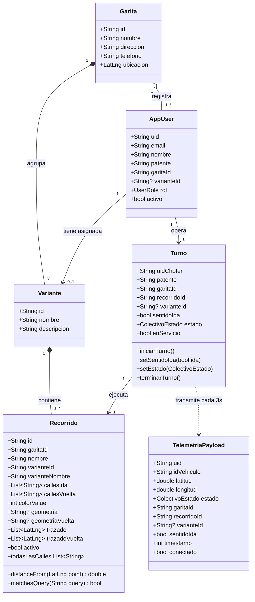
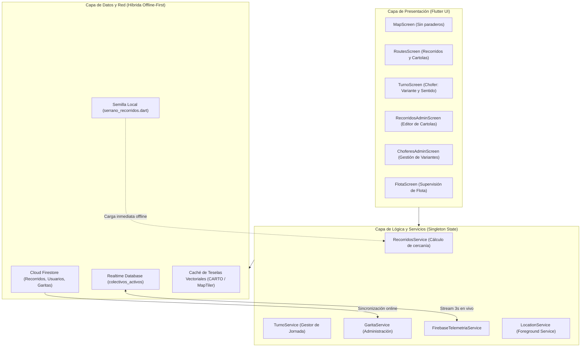
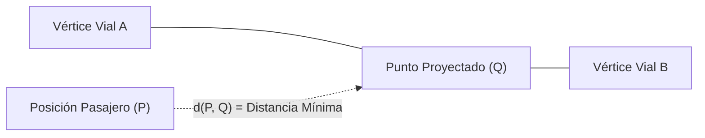
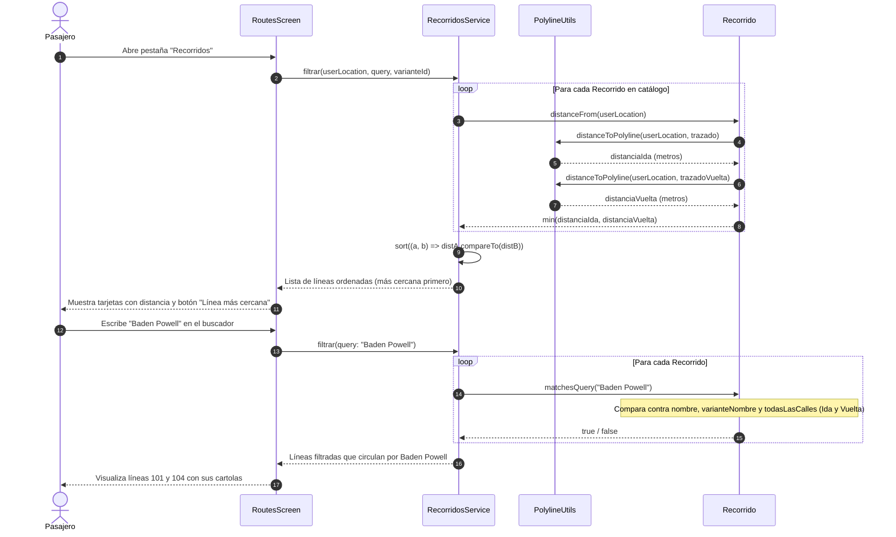
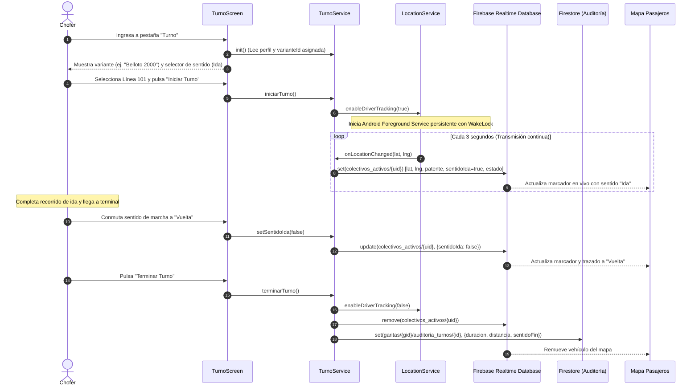
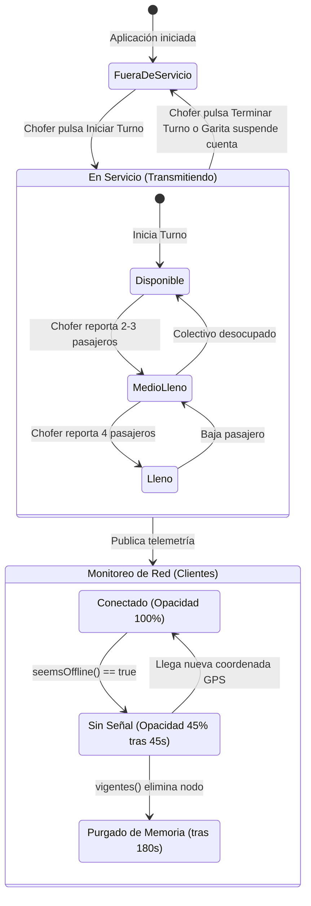
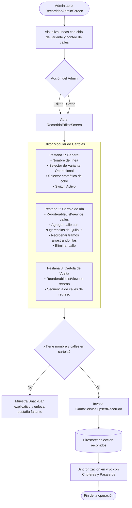

# Arquitectura y Diseño Técnico: Recorridos, Cartolas y Variantes en ColeTotal
## Reconstrucción Formal del Proceso de Diseño Omitido en el Desarrollo Asistido por Agentes

---

### Resumen Ejecutivo y Motivación

En el desarrollo tradicional de software, el proceso previo a la codificación involucra semanas de levantamiento de requerimientos, diseño conceptual, especificación de modelos relacionales, diagramas de secuencia UML y formalización matemática de algoritmos. Cuando se emplean agentes autónomos y asistentes de inteligencia artificial, este proceso de ingeniería suele ocurrir de forma tácita en el espacio de razonamiento interno del modelo, traduciéndose de inmediato en código funcional sin dejar rastro documental formal.

Este documento tiene como propósito **recuperar y formalizar explícitamente todo el diseño de ingeniería** detrás de la transición de ColeTotal desde un modelo estándar de paraderos urbanos (tipo buses/micros) hacia el modelo operacional real de **Taxis Colectivos Chilenos** en la comuna de Quilpué (Transportes Serrano).

---

## 1. Justificación del Dominio de Negocio: La Realidad Operativa del Colectivo

### 1.1 La Discrepancia del Paradigma de "Paraderos"
En el transporte público mayor (buses urbanos, Metro, Transantiago/Red), el abordaje de pasajeros está restringido a infraestructura física segregada: **paraderos con señalética oficial y demarcación vial**. Bajo ese modelo, el ruteo de usuarios se modela como un grafo dirigido donde los vértices son paraderos estáticos $S = \{s_1, s_2, \dots, s_n\}$ y las aristas son los tramos entre ellos.

Sin embargo, en el transporte público menor chileno (**taxis colectivos**, regulados por el Decreto Supremo N° 212 del Ministerio de Transportes y Telecomunicaciones):
1. **No existen paraderos fijos:** Los pasajeros hacen parar al vehículo a mano alzada en cualquier punto de la vía pública donde esté permitido detenerse, y descienden donde lo soliciten al conductor.
2. **Visualizar paraderos en el mapa es perjudicial:** Confunde al usuario haciéndole creer que debe caminar obligatoriamente a una esquina lejana con un letrero que no existe en el terreno.

### 1.2 La Cartola Oficial como Estructura Canónica
El Ministerio de Transportes y Telecomunicaciones (MTT) formaliza la operación de una línea de colectivos a través de **Cartolas Oficiales**. Una cartola define la secuencia obligatoria de vías públicas por donde el colectivo tiene permiso de transitar:
* **Cartola de Ida:** Secuencia ordenada de calles y avenidas desde el terminal de origen hasta el punto de retorno.
* **Cartola de Vuelta:** Secuencia ordenada de calles y avenidas en sentido inverso de regreso a la garita.

### 1.3 El Concepto de Variantes y Operación de Garita
En la garita de **Transportes Serrano** (Quilpué), la línea se organiza operativamente en **tres variantes territoriales principales**:
1. **Belloto 2000:** Atiende el sector residencial de El Belloto 2000, Freire, Av. Valparaíso y Valencia.
2. **Las Rosas:** Recorre la zona de Las Rosas, Hospital de Quilpué, Los Carrera y centros de salud.
3. **El Mirador / Cumming:** Conecta Cumming, El Mirador y el centro neurálgico comercial de Quilpué.

**Regla de negocio de asignación:** Cada chofer tiene asignada una **variante base** a la que pertenece habitualmente su vehículo. No obstante, para responder a horas punta, cortes de tránsito o eventos imprevistos, **el administrador de la garita puede autorizar su reasignación temporal o permanente a otra variante**. En su jornada diaria, el chofer selecciona la línea específica y conmuta dinámicamente el sentido de marcha (**Ida** o **Vuelta**).

---

## 2. Diagramas de Diseño Formal

### 2.1 Modelo Conceptual de Dominio (Diagrama de Clases)

El siguiente diagrama detalla las entidades de datos, cardinalidades y métodos del nuevo modelo de garita:

---

### 2.2 Arquitectura del Sistema y Persistencia Offline-First

ColeTotal fue rediseñado bajo un esquema **Offline-First**, asegurando que los usuarios en zonas de cerros o con baja cobertura celular en Quilpué (como Baden Powell alto, Cumming o Marga Marga rural) continúen operando sin bloqueos:

---

### 2.3 Algoritmo Matemático: Proyección Ortogonal a la Polilínea Vial

Para calcular cuál línea de colectivos se encuentra más próxima al usuario, no se pueden usar distancias centroide o euclidianas simples a un punto fijo. El cálculo requiere encontrar la **distancia ortogonal mínima desde el punto del usuario $P$ hacia cualquier segmento de la polilínea del recorrido**.

#### Formulación Matemática
Sea la polilínea del recorrido compuesta por vértices geográficos consecutivos:
$$\mathcal{L} = \{V_1, V_2, \dots, V_N\}, \quad V_i = (\text{lat}_i, \text{lon}_i)$$

Para cada segmento definido por los puntos extremos $A = V_i$ y $B = V_{i+1}$:
1. Se define el vector del segmento: $\vec{v} = B - A$
2. Se define el vector desde $A$ hasta el punto del usuario $P$: $\vec{w} = P - A$
3. La proyección escalar de $P$ sobre la recta que contiene a $AB$ se obtiene mediante el producto punto normalizado:
$$t = \frac{\vec{w} \cdot \vec{v}}{\|\vec{v}\|^2} = \frac{(P_x - A_x)(B_x - A_x) + (P_y - A_y)(B_y - A_y)}{(B_x - A_x)^2 + (B_y - A_y)^2}$$

4. Para limitar la proyección al **segmento cerrado** $[A, B]$, el parámetro $t$ se acota al intervalo $[0, 1]$:
$$t^* = \max(0, \min(1, t))$$

5. El punto más cercano $Q$ sobre el segmento vial es:
$$Q = A + t^* \cdot \vec{v}$$

6. La distancia geodésica exacta en metros se calcula aplicando la fórmula de Haversine:
$$d(P, Q) = 2 R \arcsin \left( \sqrt{\sin^2\left(\frac{\Delta \phi}{2}\right) + \cos(\phi_P) \cos(\phi_Q) \sin^2\left(\frac{\Delta \lambda}{2}\right)} \right)$$
Donde $R = 6.371.000\text{ m}$, $\phi = \text{latitud}$ y $\lambda = \text{longitud}$.

7. La distancia del usuario a la línea completa corresponde al ínfimo de todos los segmentos:
$$D_{\text{recorrido}}(P) = \min_{i = 1 \dots N-1} d(P, Q_i)$$

---

### 2.4 Diagrama de Secuencia: Consulta y Búsqueda por Cartola

El siguiente diagrama detalla cómo un pasajero consulta las líneas ordenadas por cercanía y busca una calle específica dentro de las cartolas oficiales:

---

### 2.5 Diagrama de Secuencia: Ciclo de Vida del Turno del Chofer y Telemetría

Describe cómo opera el conductor en su jornada, cómo se valida su variante asignada y cómo se sincroniza el sentido de marcha en tiempo real:

---

### 2.6 Máquina de Estados del Colectivo en Tiempo Real

El vehículo en servicio transita a través de estados operacionales y estados de conectividad:

---

### 2.7 Flujo de Administración: Modelado de Recorridos por Cartolas

El nuevo editor de recorridos (`RecorridoEditorScreen`) permite a la garita modelar y adaptar sus líneas de manera visual y estructurada:

---

## 3. Matriz de Trazabilidad entre Requerimientos y Casos de Prueba

| Requerimiento del Sistema | Módulo Implementado | Caso de Prueba Formal (Word/Plan) | Estado |
| :--- | :--- | :--- | :--- |
| **RF-01: Mapa Interactivo sin Paraderos** | `lib/screens/map_screen.dart` | **P01** | Implementado & Verificado |
| **RF-02: Seguimiento GPS Continuo** | `lib/services/location_service.dart` | **P02** | Implementado & Verificado |
| **RF-03: Pestaña Recorridos y Proximidad** | `lib/screens/routes_screen.dart` | **P03** | Implementado & Verificado |
| **RF-04: Consulta de Cartola Oficial** | `lib/screens/routes_screen.dart` | **P04** | Implementado & Verificado |
| **RF-05: Proyección Ortogonal a Traza** | `lib/utils/polyline.dart` | **P05** | Implementado & Verificado |
| **RF-06: Turno Chofer, Variante y Sentido** | `lib/screens/driver/turno_screen.dart` | **P06** | Implementado & Verificado |
| **RF-07: Semaforización de Capacidad** | `lib/services/turno_service.dart` | **P07** | Implementado & Verificado |
| **RF-08: Monitoreo de Sentido de Marcha** | `lib/screens/map_screen.dart` | **P08** | Implementado & Verificado |
| **RF-09: Consola de Supervisión de Flota** | `lib/screens/admin/flota_screen.dart` | **P09** | Implementado & Verificado |
| **RF-10: Administración de Variantes** | `lib/screens/admin/choferes_admin_screen.dart` | **P10** | Implementado & Verificado |
| **RF-11: Editor de Cartolas de Garita** | `lib/screens/admin/recorridos_admin_screen.dart` | **P11** | Implementado & Verificado |
| **RF-12: Suspensión Inmediata de Chofer** | `lib/services/garita_service.dart` | **P12** | Implementado & Verificado |
| **RF-13: Enrolamiento por Código Secreto** | `lib/screens/auth/register_screen.dart` | **P13** | Implementado & Verificado |
| **RF-14: Operación Offline Resiliente** | `lib/data/serrano_recorridos.dart` | **P14** | Implementado & Verificado |
| **RF-15: Interfaz Responsiva Móvil/Tablet** | `lib/screens/main_screen.dart` | **P15** | Implementado & Verificado |
| **RF-16: Navegación Cartográfica Fluida** | `lib/widgets/app_map.dart` | **P16** | Implementado & Verificado |
| **RNF-06: Supresión de Colectivos Fantasma**| `lib/models/colectivo_activo.dart` | **P17** | Implementado & Verificado |
| **Operacional: Actualización OTA Segura** | `lib/services/app_update_service.dart` | **P18** | Implementado & Verificado |

---

## 4. Conclusiones para la Defensa de Título

1. **Alineación con el Territorio:** Al suprimir los paraderos y adoptar cartolas oficiales y variantes, ColeTotal deja de ser una copia de aplicaciones metropolitanas genéricas y se convierte en una herramienta **fiel al modelo regulatorio y operativo real de los taxis colectivos chilenos**.
2. **Eficiencia y Precisión Computacional:** El uso de proyecciones ortogonales geodésicas escalares ($\mathcal{O}(N)$ por trazado) garantiza ordenamientos instantáneos en el dispositivo móvil sin depender de servidores de ruteo externos para calcular cercanía.
3. **Rigurosidad Metodológica:** Al explicitar y diagramar formalmente los modelos conceptuales, arquitecturas, máquinas de estados y secuencias de interacción, el proyecto subsana el vacío documental que suele generarse al utilizar agentes autónomos en la generación de código.
