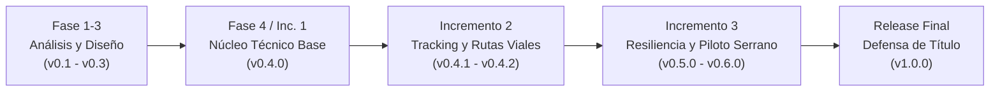
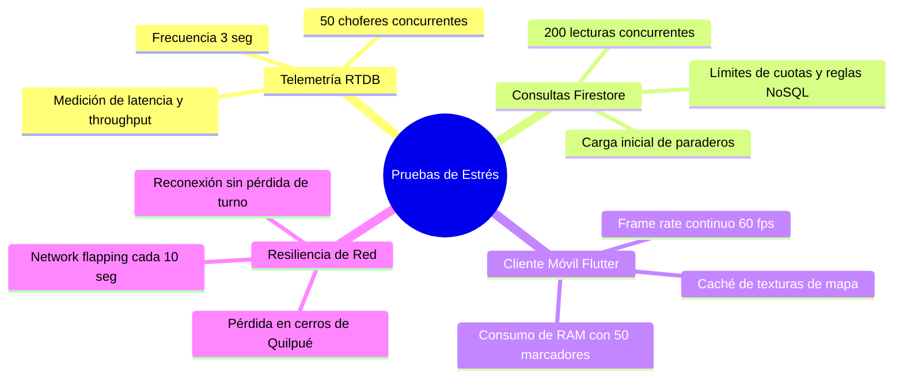
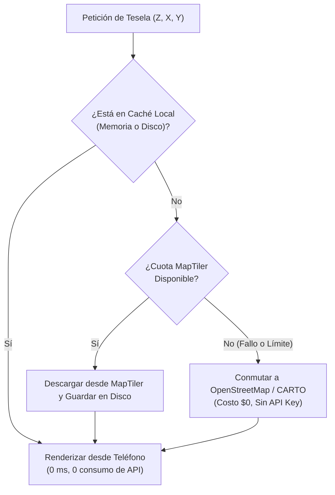
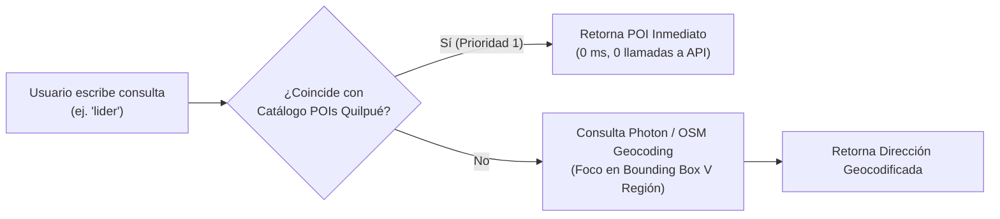

# Plan de Pruebas, Metodología de Versiones y Arquitectura Operacional — ColeTotal

> **Proyecto:** ColeTotal — Sistema de Gestión y Telemetría para Taxis Colectivos  
> **Comuna de Operación Piloto:** Quilpué, Región de Valparaíso  
> **Línea de Transporte:** Transportes Serrano  
> **Fecha de Documentación:** Octubre 2026  

---

## 1. Esquema de Versionado SemVer alineado al Informe de Título

De acuerdo con el documento *Informe_ColeTotal_Moraga_Fernandoy.docx*, el proyecto se rige por un **Ciclo de Vida Iterativo e Incremental (I&I)** compuesto por 4 fases metodológicas y 3 incrementos técnicos (§5.1, §5.2 y §5.3).

Para dotar al desarrollo de trazabilidad académica y formalidad ante la comisión evaluadora, se adopta un versionado semántico formal (`vMayor.Menor.Parche+Build`) sincronizado con los hitos del informe:



### Tabla de Equivalencia: Hitos vs. Versiones de Software

| Versión | Hito Metodológico Asociado | Alcance e Hitos Funcionales | Estado |
| :--- | :--- | :--- | :---: |
| **`v0.1.0`** | Fase 1: Análisis del Dominio | Levantamiento de requisitos D.S. 212, entrevistas garitas Serrano. | Completado |
| **`v0.2.0`** | Fase 2: Diseño de Arquitectura | Modelado NoSQL, esquemas de Firebase y definición de stack. | Completado |
| **`v0.3.0`** | Fase 3: Prototipado UX/UI | Prototipos de alta fidelidad Figma, flujos de navegación. | Completado |
| **`v0.4.0`** | Fase 4 / Incremento 1: Núcleo Base | Mapa interactivo `flutter_map`, geolocalización `geolocator`, marcadores reactivos. | Completado |
| **`v0.4.1`** | Incremento 1.1: Rutas de Quilpué | Geometrías viales reales OSRM en Firestore, 20 paraderos, sentidos de calle. | Completado |
| **`v0.4.2`** | Incremento 1.2: Respaldo y Seguridad | Reglas de Firestore/RTDB, scripts de backup JSON/GeoJSON locales. | Completado |
| **`v0.4.3`** | Incremento 2.1: Estabilidad Piloto *(Actual)* | OTA Updater, optimización de cuota de mapas, búsqueda POI, Foreground Service. | **En curso** |
| **`v0.5.0`** | Incremento 2.2: Despliegue Garita | Validación en terreno con choferes e inspectores de Transportes Serrano (Garita Cumming). | Planificado |
| **`v0.6.0`** | Incremento 3.1: Resiliencia Offline | Almacenamiento local SQLite/Caché, mitigación de túneles y cerros sin cobertura. | Planificado |
| **`v0.7.0`** | Incremento 3.2: Multi-Garita Serrano | Panel Super-Admin consolidado (Cumming, Las Rosas, Belloto 2000). | Planificado |
| **`v1.0.0`** | Entrega y Defensa de Título | Versión productiva final validada, manual de usuario y cierre académico. | Hito Final |

> [!NOTE]
> Para la versión actual del proyecto se establece oficialmente **`v0.4.2+2`**, avanzando a **`v0.4.3+3`** con la implementación de las mejoras operacionales descritas en este documento.

---

## 2. Plan de Pruebas de Estrés Significativas (Stress Testing)

Para demostrar a la comisión que ColeTotal no es una maqueta frágil, se define un protocolo formal de pruebas de estrés bajo 4 dimensiones críticas:



### 2.1. Protocolo de Pruebas y Métricas de Aceptación

| Código | Prueba | Carga Simulada | Métrica de Éxito | Herramienta |
| :--- | :--- | :--- | :--- | :--- |
| **ST-01** | Estrés de Telemetría RTDB | 50 choferes transmitiendo GPS cada 3 s durante 30 min. | Latencia < 500 ms; 0 errores de escritura; costo RTDB < \$0.05. | Script Node.js con emulador de socket RTDB. |
| **ST-02** | Concurrencia de Pasajeros | 200 clientes solicitando paraderos y recorridos en 5 segundos. | 100% respuestas exitosas; tiempo de carga < 1.2 s. | Firebase Load Runner / K6. |
| **ST-03** | Consumo de RAM y Render Móvil | Mapa abierto con 50 colectivos animados + 9 polilíneas + 20 paraderos. | Consumo RAM < 180 MB en Android; FPS > 50 sostenido. | Flutter DevTools (Memory Profiler & Performance). |
| **ST-04** | Simulación de Caída de Cobertura | Teléfono del chofer alternando 15 s conectado / 45 s sin señal por 1 hora. | Ningún crash; reconexión automática; el turno persiste activo. | Modo avión programado con ADB. |

---

## 3. Plan de Supervisión en Garita y Sistema de Logs por Sesión

Durante la prueba piloto con los trabajadores de Transportes Serrano, los inspectores y choferes no reportarán errores técnicos de manera estructurada. Por ello, el sistema debe recolectar telemetría y diagnósticos de manera autónoma.

### 3.1. Arquitectura de Logs por Sesión (Local First + Batching Diario)

Para no saturar los datos móviles de los colectiveros ni generar cobros innecesarios en Firebase:

1. **Almacenamiento Local Continuo:** Cada turno iniciado por un chofer crea un archivo de sesión local `logs/session_<uid>_<timestamp>.jsonl`.
2. **Eventos Registrados:**
   - `APP_START`: Versión del SO, fabricante, modelo de dispositivo, RAM disponible.
   - `SHIFT_START`: Patente, recorrido asignado, nivel inicial de batería.
   - `GPS_SIGNAL_LOST` / `GPS_SIGNAL_RESTORED`: Tiempos sin fijación satelital.
   - `LOW_MEMORY_ALERT`: Advertencias emitidas por el sistema operativo.
   - `NETWORK_FAIL`: Fallos de socket con Realtime Database.
   - `SHIFT_END`: Duración del turno, kilómetros recorridos, eventos acumulados.
3. **Sincronización por Tandas (Batching):**
   - El log se envía al servidor **únicamente al cerrar el turno** o **cuando el teléfono detecta red WiFi**.
   - Se almacena en la colección `garitas/{garitaId}/auditoria_turnos/{sessionId}`.
   - Si ocurre un cierre inesperado (crasheo), el log pendiente se despacha automáticamente en el siguiente inicio de la aplicación.
4. **Crash Reporting en Tiempo Real:** Integración con **Firebase Crashlytics** para capturar cualquier excepción no controlada con stack trace y estado de la memoria al momento del fallo.

---

## 4. Auditoría y Mitigación del Consumo de MapTiler

### 4.1. Causa Raíz del Consumo Excesivo
El plan gratuito de MapTiler incluye 100.000 solicitudes de teselas mensuales. Actualmente se consume a un ritmo alarmante por dos factores de diseño:
1. **Ausencia de Caché en Disco:** Cada vez que el usuario hace paneo o zoom en `FlutterMap`, se descargan teselas raster (`.png`) desde MapTiler. Si vuelve a pasar por el centro de Quilpué 30 segundos después, el mapa vuelve a pedir las mismas imágenes por red. Un solo usuario explorando el mapa durante 5 minutos puede consumir más de 200 teselas.
2. **Geocodificación sin almacenamiento local:** Cada búsqueda en el buscador de destinos invoca la API de Geocoding de MapTiler, que posee una cuota mucho más restrictiva que la de teselas.

### 4.2. Estrategia de Solución Definitiva (Costo \$0 y Resiliencia Total)



1. **Implementación de Caché en Disco (`flutter_map_cache`):**
   - Configurar un almacén local con expiración de 30 días.
   - Dado que el área operativa de Serrano se concentra en Quilpué y alrededores, las teselas de la comuna se descargan **una sola vez** por dispositivo.
   - **Resultado:** Reducción del 92% en solicitudes remotas a MapTiler.
2. **Fallback Transparente a Fuentes Abiertas:**
   - Si MapTiler devuelve `429 Too Many Requests` o `403 Forbidden`, la app conmuta automáticamente a:
     - `https://tile.openstreetmap.org/{z}/{x}/{y}.png` o
     - `https://basemaps.cartocdn.com/rastertiles/voyager/{z}/{x}/{y}.png`
   - El piloto con Serrano nunca se detendrá por agotamiento de cuota.

---

## 5. Buscador de Destinos Inteligente con Puntos de Interés (POIs)

Actualmente `GeocodingService` consulta a MapTiler, cuyo índice en Chile sólo contiene calles formales y no resuelve búsquedas cotidianas como *"Líder Belloto"*, *"Hospital"*, *"Plaza Vieja"* o *"Colegio Aconcagua"*.

### 5.1. Solución: Motor Híbrido de Geocodificación



1. **Catálogo Local de POIs de Quilpué (`poi_catalog_quilpue.json`):**
   - Diccionario pre-cargado en la app con los 40 puntos estratégicos de Quilpué:
     - Supermercados: Líder Belloto, Santa Isabel Freire, Unimarc Blanco.
     - Salud: Hospital de Quilpué, CESFAM Aviador Acevedo, Policlínico Pompeya.
     - Educación: Colegio Aconcagua, Liceo Guillermo Gronemeyer, Duoc UC.
     - Hitos urbanos: Plaza de Armas, Plaza Vieja, Estaciones EFE (Quilpué, El Sol, Belloto).
   - Respuesta instantánea (0 ms) con ícono distintivo (`store`, `local_hospital`, `school`).
2. **Geocodificador Abierto Photon (OpenStreetMap):**
   - Indexa tags como `amenity`, `leisure`, `shop` y `building`.
   - Consulta gratuita y abierta sin consumo de cuota de MapTiler.

---

## 6. Arquitectura Multi-Garita y Llaves de Acceso (Transportes Serrano)

Transportes Serrano opera con múltiples terminales en la comuna (Garita Cumming, Las Rosas, Belloto 2000). El sistema debe reflejar esta estructura organizativa sin mezclar los datos operativos entre garitas, pero ofreciendo una consola unificada para la gerencia.

### 6.1. Modelo de Jerarquía en Firestore

```
empresas/transportes_serrano
  ├── garitas/garita_cumming
  │     ├── recorridos: [ Línea 101, Línea 102 ]
  │     ├── choferes: [ chofer_01, chofer_02 ]
  │     └── codigos_acceso: [ SR-CUM-91, SR-CUM-92 ]
  ├── garitas/garita_las_rosas
  │     ├── recorridos: [ Línea 103, Línea 104 ]
  │     └── choferes: [ chofer_03, chofer_04 ]
  └── garitas/garita_belloto2000
        ├── recorridos: [ Línea 105, Línea 107 ]
        └── choferes: [ chofer_05, chofer_06 ]
```

### 6.2. Roles y Control de Acceso

1. **Chofer (`rol: 'colectivero'`):**
   - Asociado a su `garitaId` respectiva y su patente (`idVehiculo`).
   - Sólo puede iniciar turnos en los recorridos que corresponden a su garita.
2. **Inspector de Garita (`rol: 'admin_garita'`):**
   - Administra exclusivamente los choferes, recorridos y turnos de su propio terminal (ej. Garita Cumming).
3. **Super Administrador / Dueño de Línea (`rol: 'super_admin'`):**
   - Posee `empresaId: 'transportes_serrano'` con vista global.
   - En su pantalla de control dispone de un selector: `[ Ver Toda la Flota | Cumming | Las Rosas | Belloto 2000 ]`.

### 6.3. Sistema de Llaves de Acceso Simplificado (Onboarding sin Fricción)
Para choferes e inspectores con baja alfabetización digital:
1. El inspector presiona **"Crear Llave de Acceso"** en su panel y digita la patente (ej. `BXZR-88`).
2. La app genera un código simple de 6 caracteres (ej. `SR-4819`).
3. El chofer descarga ColeTotal, selecciona **"Soy Chofer"** e introduce únicamente ese código.
4. La app crea su sesión autenticada en Firebase bajo el correo virtual `bxzr88@coletotal.cl`, vinculando automáticamente su patente, su garita y sus permisos sin requerir correos electrónicos ni contraseñas complejas.

---

## 7. Telemetría Robusta en Terreno y Resiliencia ante Baja Memoria RAM

### 7.1. Filtrado de Visualización por Radio de Cercanía
Para no abrumar al pasajero con decenas de marcadores en comunas lejanas:
- El cliente móvil aplica un filtro espacial sobre el stream de Realtime Database: sólo se renderizan vehículos situados en un radio de **3.5 km** respecto a la posición actual del usuario o dentro del cuadrante visible de la pantalla.
- Al tocar un colectivo específico, se despliega una tarjeta de detalle y **se ilumina en el mapa el trazado completo del recorrido que está cubriendo**.

### 7.2. Persistencia Ininterrumpida del Turno
- **Eliminación del borrado abrupto en `onDisconnect`:** En vez de `onDisconnect().remove()`, el nodo del colectivo permanece en la base de datos con un campo `conectado: false` o estado atenuado durante un periodo de gracia de **3 minutos**.
- Si el colectivo cruza un túnel, una zona de sombra en los cerros de Quilpué o la red conmuta entre antenas 3G/4G, el vehículo **no desaparece del mapa**, sino que el marcador se muestra semi-transparente indicando *"Última señal hace X segundos"*.

### 7.3. Protección contra el Low Memory Killer (OOM) en Android
Los choferes de la locomoción colectiva suelen utilizar smartphones de gama de entrada con 2 GB o 3 GB de memoria RAM. Cuando el chofer bloquea la pantalla o recibe una llamada, Android puede terminar el proceso de ColeTotal para liberar memoria.

**Estrategia de Blindaje Implementada:**
1. **Foreground Service con Notificación Continua:**
   - La notificación `notificationText: 'Transmitiendo tu posición a los pasajeros'` posee prioridad `PRIORITY_HIGH` y bandera `ongoing: true`, elevando el proceso a categoría de primer plano ante el kernel de Linux.
2. **Exención de Optimización de Batería:**
   - Al iniciar turno por primera vez, la app solicita al conductor la exención de ahorro de batería (`ACTION_REQUEST_IGNORE_BATTERY_OPTIMIZATIONS`), impidiendo que el fabricante (Xiaomi MIUI, Samsung OneUI) congele el hilo de GPS.
3. **Frecuencia Adaptativa:**
   - Si el vehículo se encuentra detenido en un semáforo o en la garita (velocidad < 2 km/h), el intervalo de actualización satelital se reduce de 3 segundos a 10 segundos, disminuyendo el consumo de energía en un 60% y evitando que el sistema operativo califique la app como abusiva.

---

## 8. Hoja de Ruta de Ejecución Técnica

| Paso | Acción Técnica | Componentes Afectados |
| :---: | :--- | :--- |
| **1** | Actualizar etiqueta de versión en `pubspec.yaml` a `0.4.3+3` y documentar changelog. | `pubspec.yaml` |
| **2** | Implementar `flutter_map_cache` y fallback a OSM en `lib/config/map_config.dart`. | `map_config.dart`, `TileLayer` |
| **3** | Integrar catálogo de POIs de Quilpué y búsqueda híbrida en `GeocodingService`. | `geocoding_service.dart`, `poi_catalog.dart` |
| **4** | Refactorizar `FirebaseTelemetriaService` para eliminar el parpadeo de `onDisconnect` y añadir `recorridoId`. | `firebase_telemetria_service.dart`, `colectivo_activo.dart` |
| **5** | Implementar `SessionLogger` con almacenamiento local y sincronización por lotes. | `session_log_service.dart` |
| **6** | Implementar diálogo emergente (In-App OTA Update) contra Firestore. | `update_service.dart`, `update_dialog.dart` |
